# BACwater.ai: Content Knowledge Graph

**Date:** 2026-07-02

The complete content knowledge graph, from the Organization down through Categories, Services and Products, Features, Use Cases, Supporting Resources, FAQs, Conversion Pages, and Related Topics. For every major node: parent topic, child topics, related topics, supporting pages, conversion pages, and internal-link opportunities. Grades relationships as existing, missing, or weak, and calls out authority-signal opportunities.

Companion files: `entity-map.md` (nodes), `entity-relationship-map.md` (entity edges), `topic-cluster-map.md` (pillar/cluster view).

---

## Full graph (Mermaid)

```mermaid
graph TD
    ORG["Organization: BACwater.ai"]

    ORG --> CAT_LEARN["Category: Learn / Knowledge"]
    ORG --> CAT_PEP["Category: Peptides (24)"]
    ORG --> CAT_TOOLS["Category: Tools & Calculators"]
    ORG --> CAT_SHOP["Category: Shop / Supplies"]
    ORG --> CAT_PLAN["Service: Plan Builder"]

    CAT_LEARN --> L_GUIDE["Guides (~16 DB)"]
    CAT_LEARN --> L_VS["Comparisons (7)"]
    CAT_LEARN --> L_FAQ["FAQ hub"]

    CAT_PEP --> P_HUB["/peptides hub"]
    P_HUB --> P_META["Metabolic GLP-1: sema, tirz, reta, cagri"]
    P_HUB --> P_HEAL["Healing: bpc-157, tb-500"]
    P_HUB --> P_GROW["Growth: ipamorelin, cjc x2, sermorelin, hexarelin"]
    P_HUB --> P_REST["Cognitive / cosmetic / reproductive / longevity / other"]

    CAT_TOOLS --> T_BAC["/tools/bac-water"]
    CAT_TOOLS --> T_REC["/tools/reconstitution"]
    CAT_TOOLS --> T_DOSE["/tools/dose"]
    CAT_TOOLS --> T_SYR["/tools/syringe-units"]
    CAT_TOOLS --> T_SUP["/tools/supplies"]
    CAT_TOOLS --> T_MG["/tools/mg-to-mcg"]

    CAT_SHOP --> S_BAC["BAC water 30mL + multipacks"]
    CAT_SHOP --> S_SYR["Insulin syringes 0.3/0.5/1mL"]
    CAT_SHOP --> S_PAD["Alcohol prep pads"]
    CAT_SHOP --> S_KIT["Starter kit"]

    %% Features
    CAT_PLAN --> F_SAVE["Feature: saved plans"]
    CAT_PLAN --> F_PDF["Feature: PDF export"]
    CAT_PLAN --> F_QR["Feature: QR-coded vial labels"]

    %% Use cases
    P_META --> UC_GLP["Use case: reconstitute a GLP-1"]
    T_REC --> UC_CALC["Use case: get exact BAC water volume"]
    CAT_PLAN --> UC_PLAN["Use case: full protocol plan + label"]

    %% Supporting + FAQ + conversion
    P_META -. supported by .-> L_GUIDE
    P_META -. supported by .-> L_VS
    UC_GLP -. answered in .-> L_FAQ
    P_META -->|converts to| CONV_BUY["Conversion: /buy, /shop"]
    T_REC -->|converts to| CONV_PLAN["Conversion: /plan"]
    L_GUIDE -->|converts to| CONV_BUY

    %% Related topics
    L_VS --- RT["Related topics: sterile water, saline, benzyl alcohol, acetic acid"]

    classDef conv fill:#dfe,stroke:#2a2;
    class CONV_BUY,CONV_PLAN conv;
```

---

## Node dossiers

### Node: Organization (root)

- Parent: none (graph root).
- Children: Learn, Peptides, Tools, Shop, Plan Builder.
- Related: research-peptide industry, editorial policy, disclaimers.
- Supporting pages: `/about`, `/editorial-policy`, `/disclaimer`, `/llms.txt`.
- Conversion pages: `/buy`, `/shop`, `/plan`.
- Internal-link opportunity: from every leaf page back to `/about` and `/editorial-policy` to reinforce the authority node (currently thin).

### Node: Category, Learn / Knowledge

- Parent: Organization.
- Children: ~16 guides, 7 comparisons, FAQ hub.
- Related: all topic entities (BAC water, benzyl alcohol, reconstitution, storage).
- Supporting pages: `/learn` filterable hub, `/learn/[slug]`, `/learn/vs/[topic]`.
- Conversion pages: guides should link to `/buy`, `/shop`, `/plan`.
- Internal-link opportunity: guides to tools (inline calculator links) and guides to peptide pages are the biggest untapped edges.

### Node: Category, Peptides (24)

- Parent: Organization.
- Children: 24 peptide pages across 8 categories.
- Related: reconstitution, dosing, U-100, storage topics.
- Supporting pages: `/learn` guides, 7 comparisons, all 6 calculators (embedded).
- Conversion pages: each peptide page to `/plan` (build a plan for this peptide) and `/buy` (get BAC water + syringes).
- Internal-link opportunity: cross-links between peptides in the same category are tag-driven and strong; class-level hubs (GLP-1, GH secretagogue) are missing and would consolidate authority.

### Node: Service, Plan Builder (moat)

- Parent: Organization.
- Children (Features): saved plans, PDF export, QR-coded vial labels.
- Use cases: build a full reconstitution protocol; print a labeled vial; save and reuse a plan.
- Related: all 24 peptides, reconstitution calculator, supplies.
- Supporting pages: peptide pages, reconstitution guides.
- Conversion pages: itself is the conversion (plan creation) plus supply pre-fill to `/shop`.
- Internal-link opportunity + authority signal: the pillar `/` and every peptide page should surface the Plan Builder features by name. Currently under-linked and un-schematized. This is the strongest differentiator in the graph and the biggest authority opportunity.

### Node: Category, Tools & Calculators

- Parent: Organization.
- Children: 6 calculators.
- Use cases: exact BAC water volume, dose per injection, syringe units, mg to mcg, supply totals.
- Related: reconstitution, U-100, dosing topics.
- Supporting pages: learn guides that explain each calculation.
- Conversion pages: calculators to `/plan` and `/shop`.
- Internal-link opportunity: each tool should link out to the guide that explains its math (weak today) and to the Plan Builder.

### Node: Category, Shop / Supplies

- Parent: Organization.
- Children: BAC water (single + multipacks), syringes (0.3/0.5/1mL), prep pads, starter kit.
- Use cases: buy reconstitution kit; restock a single supply.
- Related: bacteriostatic water topic, injection supplies.
- Supporting pages: buying guides, supply calculator, comparisons.
- Conversion pages: `/buy`, `/shop`, `/shop/[slug]` (these are the conversion).
- Internal-link opportunity: product pages should link to the relevant explainer guide and comparison (weak today).

### Node: FAQ hub

- Parent: Learn.
- Children: general FAQs + per-strength answerable units surfaced on peptide pages.
- Related: every topic and product.
- Supporting pages: `/faq`, peptide-page FAQ sections (FAQPage schema).
- Conversion pages: FAQ answers should link to `/plan`, `/buy`, relevant tool.
- Internal-link opportunity: FAQ answers are high-value link anchors and currently under-link to tools and shop.

---

## Relationship inventory

### Existing (strong) relationships

- Peptide page to embedded calculator (every one of 24).
- Peptide page to related reading via tag-driven `/api/related`.
- `/learn/vs/*` comparisons interlinked as a 7-page topic cluster.
- `/tools` hub to each calculator, and calculators cross-linked to siblings.
- `/shop` ItemList to each Product; supply calculator to `/shop`.
- Plan Builder to supply pre-fill in `/shop`.

### Weak relationships

- Guides to tools: prose exists, inline contextual links are thin.
- Product pages to explainer guides/comparisons: mostly one-directional or absent.
- Tools to the guide that explains their math.
- FAQ answers to conversion pages and tools.
- Last-reviewed authority signal: shown on peptide/comparison pages, not consistently in schema.

### Missing relationships

- Plan Builder features (saved plans, PDF, QR labels) to schema and to pillar/peptide surfacing.
- GLP-1 and GH-secretagogue class hubs connecting metabolic and growth peptides.
- DefinedTermSet glossary connecting topic nodes to the pages that define them.
- Cross-category conversion edges from Learn directly into Plan Builder (build a plan for what you just read).

---

## Authority-signal opportunities

1. **Surface the moat everywhere.** Name the Plan Builder features (saved plans, PDF export, QR-coded vial labels) on the pillar, every peptide page, and every calculator. Schematize them. Nothing else in the graph is unique to BACwater.ai.
2. **Class hubs.** GLP-1 and GH-secretagogue hubs give engines a class-level authority page to cite and consolidate internal links.
3. **Citation layer.** Add sourced references (like peptidefox's PubMed set) to guides and per-peptide storage/dosing claims; link them from the editorial policy.
4. **Glossary as a citable source.** A DefinedTermSet makes the site the definition source for BAC water, benzyl alcohol, lyophilization, U-100.
5. **Org-level review process.** With no bylines, publish and schema-encode a named editorial review workflow and last-reviewed dates so the Organization reads as the credentialed authority (detailed in `ai-search-readiness-analysis.md`).
6. **Conversion-linked answers.** Every FAQ and guide answer should route to `/plan` or `/buy`, turning knowledge nodes into conversion edges.
