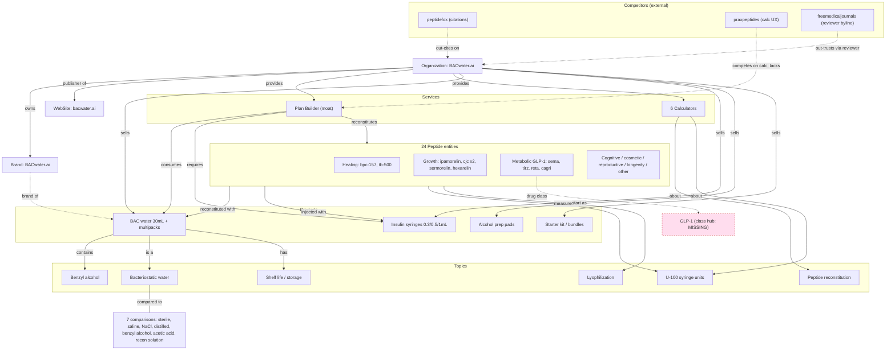

# BACwater.ai: Entity Relationship Map

**Date:** 2026-07-02

How the entities relate. This maps the edges between Organization, Brand, Product, Service/Tool, Topic, Peptide, and Competitor entities, and grades each relationship as expressed (internal link and/or schema present), weak (one direction only, or prose but no schema), missing (should exist, does not), or conflicting (contradictory signals).

Companion to `entity-map.md` (the nodes). This file is the edges.

---

## Relationship graph (Mermaid)

Solid arrows are relationships that exist on-site (link and/or schema). Dashed arrows are weak, missing, or external-competitive edges.

---

## Core structural relationships (Organization down)

| From | Edge | To | How expressed | Grade |
|------|------|----|---------------|-------|
| Organization | owns / is | Brand | Same name; no `@id` link | Weak (unify via `@id`) |
| Organization | publisher | WebSite | WebSite node under-verified | Weak/Missing |
| Organization | provides | Plan Builder | Prose only; no WebApplication node | Weak |
| Organization | provides | Calculators | Tool pages exist; sparse schema | Weak |
| Organization | sells | Products | Product schema + `/shop` ItemList | Expressed |
| Organization | author/publisher | Articles | Should be org `@id`; verify consistency | Weak |

**Priority fix:** collapse Brand and Organization into one node using a shared `@id` (`https://bacwater.ai/#organization`). Right now a name string in Product `brand` and the Organization node can read as two separate entities.

---

## Product relationships

| From | Edge | To | How expressed | Grade |
|------|------|----|---------------|-------|
| BAC water | brand | Brand/Org | `brand` string in Product schema | Weak (point to `@id`) |
| BAC water | contains ingredient | Benzyl alcohol | Prose + ingredients guide | Expressed |
| BAC water | is a | Bacteriostatic water (topic) | Direct-answer content | Expressed |
| Syringes | accessory for | BAC water / reconstitution | Not linked as accessory | Missing |
| Prep pads | accessory for | Injection process | Not linked | Missing |
| Starter kit | bundles | BAC water + syringes + pads | Bundle exists; parts not schema-linked | Weak |
| Products | featured in | Supply calculator | `/tools/supplies` -> `/shop` | Expressed |

**Fix:** use `isAccessoryOrSparePartFor` / `isRelatedTo` to connect syringes and pads to the BAC water Product, and `isSimilarTo` between pack sizes. This lets an engine understand "what do I need to reconstitute a peptide" as one connected kit.

---

## Service / Tool relationships (the moat)

| From | Edge | To | How expressed | Grade |
|------|------|----|---------------|-------|
| Plan Builder | reconstitutes | 24 peptides | Plan flow references peptides | Expressed (link) / Weak (schema) |
| Plan Builder | produces | Saved plan, PDF, QR vial label | Not in schema at all | Missing (highest-value gap) |
| Plan Builder | consumes | BAC water product | Supply pre-fill to `/shop` | Expressed |
| Calculators | about | Reconstitution / U-100 topics | Direct-answer content | Weak (add `about`) |
| Calculators | embedded in | Peptide pages | Calculator embedded per peptide | Expressed (strong) |
| `/tools` hub | lists | 6 calculators | ItemList | Expressed |

**Fix:** the Plan Builder is the one entity no competitor has, and its defining outputs (saved plans, PDF export, printable QR-coded vial labels) are invisible to machines. Add a WebApplication node naming these features and relate it (`isPartOf` Organization, `about` reconstitution topic). This is the single most valuable relationship to add.

---

## Topic relationships

| From | Edge | To | How expressed | Grade |
|------|------|----|---------------|-------|
| Bacteriostatic water | compared to | Sterile water, saline, NaCl, distilled, benzyl alcohol, acetic acid, recon solution | 7 `/learn/vs/*` pages | Expressed (strong cluster) |
| Bacteriostatic water | preserved by | Benzyl alcohol | ingredients + vs page | Expressed |
| Reconstitution | uses | BAC water | reconstitution-method guides | Expressed |
| Reconstitution | measured with | U-100 syringe units | dose + syringe guides | Expressed |
| Peptides | delivered as | Lyophilized powder | storage guides | Weak (mentioned, no DefinedTerm) |
| GLP-1 topic | groups | sema/tirz/reta/cagri | Implicit via category | Weak/Missing (no class hub) |

**Fix:** mint a DefinedTermSet glossary so each topic is a citable node, and add GLP-1 / GH-secretagogue class hubs to anchor those peptide sub-clusters.

---

## Peptide relationships

| From | Edge | To | How expressed | Grade |
|------|------|----|---------------|-------|
| Each peptide | reconstituted with | BAC water | Embedded calc + guide links | Expressed |
| Each peptide | injected with | Insulin syringe | Syringe unit content | Expressed |
| Each peptide | dosed via | Dose calculator | Embedded calculator | Expressed (strong) |
| Each peptide | member of | Category (healing/growth/etc.) | `/peptides` hub + tags | Expressed |
| Each peptide | related reading | Sibling peptides + guides | tag-driven `/api/related` | Expressed (strong) |
| Each peptide | sameAs | PubChem / DrugBank | Not present | Missing |
| glow-blend / custom | is a | Single chemical entity | Typed as peptide (risk) | Conflicting (should be guide, not compound) |

**Fix:** add external `sameAs` for disambiguation; retype `glow-blend` and `custom` as reconstitution guides so the graph does not assert a single compound identity for a blend.

---

## Competitor relationships (positioning edges)

| Competitor | Wins on | BACwater.ai edge to defend | Status |
|-----------|---------|-----------------------------|--------|
| peptidefox | PubMed citations | Sourcing policy; add citations to guides | Behind |
| freemedicaljournals | Named "medically reviewed by" | Org-level review process (no byline) | At risk (see readiness file) |
| praxpeptides | Calculator UX | Plan Builder moat | Ahead |
| riteaid | National authority + review team | Depth + tools | Mixed |
| bacteriostaticwater.com | Purchase incumbency | Content + tools | Ahead on content |

---

## Conflicting signals (must resolve)

1. **Brand name split:** any lingering "BACwater & Co." display vs "BACwater.ai" schema. Resolve to one canonical name plus `alternateName`.
2. **Blend/custom as compounds:** `glow-blend` and `custom` typed alongside single-molecule peptides risk asserting a false single-entity identity.
3. **Author ambiguity:** Articles must consistently attribute to the Organization `@id`; mixed or missing `author` reads as low-trust in a YMYL space.

---

## Missing connections (ranked)

1. Plan Builder features not in schema (highest value, unique moat).
2. WebSite node + Organization `@id` spine (needed so every other node can reference one Organization).
3. Accessory relationships: syringes/pads to BAC water.
4. GLP-1 and GH-secretagogue class hubs.
5. External `sameAs` on peptides.
6. DefinedTermSet glossary linking topics to the pages that explain them.

---

## Weak connections (ranked)

1. Product `brand` as string instead of Organization `@id`.
2. Calculators lacking `about` topic edges.
3. Lyophilization mentioned but not defined.
4. Last-reviewed dates shown but not always emitted in schema.
