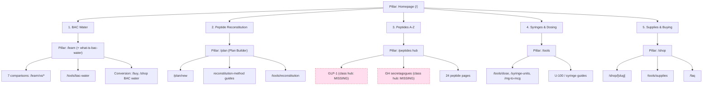

# BACwater.ai: Topic Cluster Map

**Date:** 2026-07-02 (refresh, post-implementation)

Pillar pages and their supporting clusters, from Primary Topics through Supporting Topics, Subtopics, Supporting Articles, Resource Content, and Conversion Pages. Post-implementation the site now has real content in every cluster: 24 peptide pages, ~16 database guides, 7 comparisons, 6 calculators, and the Plan Builder. This refresh grades clusters as strong, thin, overlapping, or orphaned, and flags missing supporting and authority content.

Companion files: `content-knowledge-graph.md`, `topical-authority-analysis.md`.

---

## Cluster architecture (5 primary topics)

The site organizes around five primary topics, each with a pillar hub, supporting content, and conversion pages.

---

## Cluster 1: BAC Water (core topic)

**Pillar:** `/learn` hub (+ the "what is BAC water" guide). **Strength: strong.**

| Role | Page | Status | Primary keyword |
|------|------|--------|-----------------|
| Pillar | `/learn` | Live | peptide reconstitution guides |
| Support | what-is-bac-water guide | Live (DB) | what is bacteriostatic water |
| Comparison | `/learn/vs/sterile-water` | Live | bac water vs sterile water |
| Comparison | `/learn/vs/saline` | Live | bac water vs saline |
| Comparison | `/learn/vs/sodium-chloride` | Live | bac water vs sodium chloride |
| Comparison | `/learn/vs/distilled-water` | Live | bac water vs distilled water |
| Comparison | `/learn/vs/benzyl-alcohol` | Live | benzyl alcohol in bac water |
| Comparison | `/learn/vs/acetic-acid` | Live | acetic acid vs bac water |
| Comparison | `/learn/vs/reconstitution-solution` | Live | reconstitution solution vs bac water |
| Tool | `/tools/bac-water` | Live | bac water calculator |
| Conversion | `/buy`, `/shop` BAC water | Live | buy bacteriostatic water |

**Subtopics with coverage:** shelf life / storage (covered in guides), benzyl alcohol preservative (comparison + ingredients), sterility (comparisons).
**Missing supporting content:** a dedicated shelf-life explainer as its own answerable page; a "how to store BAC water after opening" resource.
**Verdict:** the 7-comparison set is the strongest cluster on the site. Keep it interlinked and feed it from the pillar and every peptide page.

---

## Cluster 2: Peptide Reconstitution (process topic)

**Pillar:** `/plan` (Plan Builder, the moat). **Strength: strong, under-surfaced.**

| Role | Page | Status | Primary keyword |
|------|------|--------|-----------------|
| Pillar | `/plan` | Live | peptide reconstitution plan |
| Support | `/plan/new` | Live | build a reconstitution plan |
| Support | reconstitution-method guides | Live (DB) | how to reconstitute peptides |
| Support | per-peptide HowTo (24 pages) | Live | reconstitute [peptide] |
| Tool | `/tools/reconstitution` | Live | reconstitution calculator |
| Resource | peptide dosage tables (per vial strength) | Live | [peptide] dosage chart |
| Conversion | `/plan/new`, `/buy` | Live | reconstitute + buy |

**Subtopics with coverage:** per-peptide reconstitution (24 HowTo blocks), too-much/too-little BAC water (in guides), storing reconstituted peptides (storage guides).
**Missing / authority content:** a single canonical "peptide reconstitution chart" resource aggregating all strengths; the Plan Builder's unique outputs (saved plans, PDF, QR labels) are not surfaced as their own linkable, schema-backed feature content.
**Verdict:** content depth is there; the differentiator is buried. Promote the Plan Builder features into the pillar copy and link them from every peptide HowTo.

---

## Cluster 3: Peptides A-Z (entity topic)

**Pillar:** `/peptides` hub. **Strength: strong breadth, missing mid-tier hubs.**

| Role | Page | Status |
|------|------|--------|
| Pillar | `/peptides` | Live (CollectionPage/ItemList) |
| Subtopic hub | GLP-1 class hub | MISSING |
| Subtopic hub | GH-secretagogue class hub | MISSING |
| Support | 24 peptide pages | Live |
| Resource | per-peptide dosage-chart infographic | Live (ImageObject) |
| Related | tag-driven `/api/related` panels | Live |
| Conversion | `/plan`, `/buy` from each page | Live |

**Categories present:** healing, growth, metabolic, cognitive, cosmetic, reproductive, longevity, other.
**Missing supporting content:** class-level hubs (GLP-1, GH secretagogue) to group the metabolic and growth peptides and consolidate internal links and authority.
**Verdict:** 24 well-structured entity pages, but the cluster jumps straight from hub to 24 leaves. Two class hubs would give the cluster a middle tier and a stronger authority signal.

---

## Cluster 4: Syringes & Dosing (measurement topic)

**Pillar:** `/tools`. **Strength: strong tools, thin explainer layer.**

| Role | Page | Status | Primary keyword |
|------|------|--------|-----------------|
| Pillar | `/tools` | Live | peptide calculators |
| Support | `/tools/dose` | Live | peptide dose calculator |
| Support | `/tools/syringe-units` | Live | syringe units to ml |
| Support | `/tools/mg-to-mcg` | Live | mg to mcg converter |
| Support | U-100 / insulin syringe guides | Live/partial (DB) | how to read insulin syringe |
| Conversion | `/plan`, `/shop` syringes | Live | buy insulin syringes |

**Subtopics with coverage:** U-100 unit reading, syringe sizes (0.3/0.5/1mL), mg-to-mcg conversion.
**Missing supporting content:** a needle-gauge guide; a dedicated "how to read an insulin syringe" explainer that is not just a tool page.
**Verdict:** tools are excellent and cross-linked; the teaching content that would let these pages win informational queries is thin. Each tool should link to and from a plain-language guide.

---

## Cluster 5: Supplies & Buying (commercial topic)

**Pillar:** `/shop`. **Strength: functional, weakly linked to content.**

| Role | Page | Status | Primary keyword |
|------|------|--------|-----------------|
| Pillar | `/shop` | Live (ItemList) | buy bacteriostatic water |
| Support | `/shop/[slug]` PDPs | Live | (per product) |
| Support | `/tools/supplies` | Live | peptide supply calculator |
| Support | buying-guide content type | Live (DB) | where to buy bac water |
| Resource | `/faq` | Live (FAQPage) | bac water faq |
| Conversion | `/buy`, `/shop`, PDPs | Live | (transactional) |

**Missing supporting content:** multi-dose vial hygiene resource; a buying guide that maps supplies to specific peptide protocols.
**Verdict:** the commerce layer works but is the most siloed. Product pages need contextual links to explainer guides and comparisons so authority flows in.

---

## Cross-cluster linking

| From | To | Link point | Status |
|------|----|-----------|--------|
| BAC Water | Reconstitution | what-is-bac-water to reconstitution method | Present |
| BAC Water | Supplies | comparisons to `/shop` BAC water | Weak |
| Reconstitution | Peptides A-Z | Plan Builder to 24 peptide pages | Present |
| Peptides A-Z | Syringes & Dosing | peptide dose section to dose calc | Present (embedded) |
| Syringes | Supplies | syringe guide to `/shop` syringes | Weak |
| Supplies | All | supply calc to plan + learn | Weak |
| FAQ | All | answer links to tools/shop/plan | Weak |

---

## Cluster health summary

| Cluster | Pillar | Depth | Interlinking | Main gap |
|---------|--------|-------|--------------|----------|
| 1. BAC Water | `/learn` | Strong | Strong | Standalone shelf-life page |
| 2. Reconstitution | `/plan` | Strong | Good | Surface Plan Builder moat |
| 3. Peptides A-Z | `/peptides` | Strong breadth | Good | Missing class hubs |
| 4. Syringes & Dosing | `/tools` | Tools strong, guides thin | Mixed | Explainer guides |
| 5. Supplies & Buying | `/shop` | Functional | Weak | Content-to-commerce links |

---

## Missing, weak, overlapping, and orphaned content

**Missing supporting content:**
- GLP-1 and GH-secretagogue class hubs (Cluster 3).
- Standalone BAC water shelf-life explainer (Cluster 1).
- Needle-gauge and "read an insulin syringe" guides (Cluster 4).
- Multi-dose vial hygiene resource (Cluster 5).
- Aggregated peptide reconstitution chart (Cluster 2).

**Missing authority-building content:**
- A sourced reference/citation layer (to match peptidefox's PubMed set).
- A DefinedTermSet glossary (BAC water, benzyl alcohol, lyophilization, U-100, half-life).
- A named editorial-review process page (org-level E-E-A-T, no bylines).

**Weak clusters:** Cluster 5 (commerce siloed from content); Cluster 4 explainer layer.

**Overlapping clusters:** BAC Water and Reconstitution both use `/learn` guides; keep the pillar assignment clear (BAC Water pillar = `/learn`; Reconstitution pillar = `/plan`) so guides link up to the right hub and do not compete. The 7 comparisons belong to Cluster 1 only.

**Orphaned content risk:** utility pages (`/disclaimer`, `/shipping-returns`, `/editorial-policy`) are linked mainly from the footer; that is acceptable, but `/editorial-policy` should also be linked contextually from peptide and guide pages to feed the authority node. Confirm no `/learn/[slug]` guide is reachable only from the hub with no sibling or contextual inbound links.

---

## Roadmap by cluster (next 6 weeks)

- Weeks 1-2: build GLP-1 and GH-secretagogue class hubs (Cluster 3); surface Plan Builder features in pillar + peptide pages (Cluster 2).
- Weeks 3-4: ship shelf-life explainer (Cluster 1), needle-gauge + insulin-syringe guides (Cluster 4); wire guide-to-tool contextual links.
- Weeks 5-6: multi-dose vial hygiene (Cluster 5), glossary DefinedTermSet, citation layer, editorial-review process page; strengthen content-to-commerce links.
